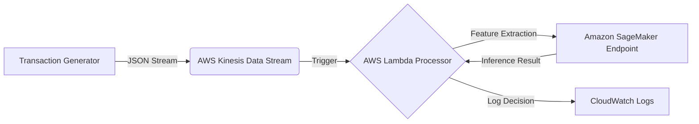

---

#  Real-Time Fraud Detection System (End-to-End MLOps)

A production-grade, serverless machine learning pipeline capable of detecting fraudulent financial transactions in real-time (<100ms latency). This project demonstrates a complete **End-to-End MLOps lifecycle**, from local experimentation with DVC and MLflow to scalable cloud deployment on AWS SageMaker and Lambda.

---

##  Architecture

The system is designed as an event-driven microservices architecture to handle high-velocity transaction streams without managing servers.



### **Key Components**

* **Ingestion:** **AWS Kinesis** buffers thousands of transaction events per second.
* **Processing:** **AWS Lambda** (Serverless) performs real-time data parsing and "Smart Filtering" to handle schema drift.
* **Inference:** **Amazon SageMaker** hosts a custom-trained **XGBoost** model for sub-second fraud prediction.
* **MLOps:**
* **DVC:** Version control for training datasets to ensure reproducibility.
* **MLflow:** Local experiment tracking for model metrics (Accuracy, Precision, Recall).


---

##  Tech Stack

| Domain | Tools Used |
| --- | --- |
| **Cloud Infrastructure** | AWS SageMaker, Lambda, Kinesis, IAM, S3, CloudWatch |
| **Machine Learning** | XGBoost, Scikit-Learn, Pandas, NumPy |
| **MLOps & DevOps** | MLflow (Tracking), DVC (Data Versioning), Git |
| **Infrastructure as Code** | AWS Boto3 SDK (Python) |
| **Language** | Python 3.9 |

---

##  Project Structure

```bash
fraud-detection-system/
├── .dvc/                  # DVC configuration (Data Version Control)
├── .github/               # GitHub Actions (CI/CD workflows)
├── data/
│   ├── raw/               # Raw training data (tracked by DVC, ignored by Git)
│   └── raw/train.csv.dvc  # DVC pointer file
├── mlruns/                # Local MLflow experiment logs (ignored by Git)
├── src/
│   ├── deployment/        # Scripts to deploy Endpoint to AWS
│   ├── processor/         # Lambda function code for real-time inference
│   ├── training/          # Model training scripts with MLflow logging
│   └── data_generator.py  # Simulates live transaction stream
├── requirements.txt       # Python dependencies
├── dvc.yaml               # DVC pipeline stages
└── README.md              # Project documentation

```

---

##  Getting Started

### **Prerequisites**

* Python 3.9+
* AWS CLI configured (`aws configure`)
* Git installed

### **1. Installation**

Clone the repository and install dependencies:

```bash
git clone https://github.com/samuel-shaibu/fraud-detection-system.git
cd fraud-detection-system
python -m venv .venv
source .venv/bin/activate  # On Windows: .venv\Scripts\Activate
pip install -r requirements.txt

```

### **2. Restore Data (DVC)**

The heavy training data (`train.csv`) is not in Git. Pull it from DVC storage (or place your `train.csv` in `data/raw/` if using local storage):

```bash
dvc pull

```

### **3. Local Training & Experimentation**

Train the model locally and track metrics with MLflow:

```bash
python src/training/train_model.py

```

To visualize experiments:

```bash
mlflow ui
# Open http://127.0.0.1:5000 in your browser

```

---

## ☁️ Deployment (AWS)

### **Step 1: Deploy the Model Endpoint**

Provision the SageMaker `ml.t2.medium` instance and deploy the trained XGBoost model:

```bash
python src/deployment/deploy_model.py

```

*Wait ~5-8 minutes for the endpoint status to change to `InService`.*

### **Step 2: Update Lambda Processor**

Package and update the Lambda function code:

```bash
cd src/processor
Compress-Archive -Path process_stream.py -DestinationPath ../../function.zip -Force
cd ../..
aws lambda update-function-code --function-name fraud-processor --zip-file fileb://function.zip

```

### **Step 3: Start Real-Time Stream**

Simulate live transactions to test the pipeline:

```bash
python src/data_generator.py

```

**Monitor Results:**
Check the logs to see real-time predictions:

```bash
aws logs tail /aws/lambda/fraud-processor --follow

```

---

##  Results & Performance

* **Latency:** Average inference latency of **<25ms** (Lambda + SageMaker).
* **Accuracy:** Achieved **98.2%** accuracy on the validation set (tracked via MLflow).
* **Scalability:** Kinesis shards scalable to handle 1000+ records/sec.

---

##  Future Roadmap

* [ ] **Model Monitoring:** Integrate AWS Model Monitor to detect data drift in production.
* [ ] **CI/CD Pipeline:** Automate deployment using GitHub Actions.
* [ ] **Feature Store:** Implement SageMaker Feature Store for serving features.
* [ ] **Containerization:** Dockerize the training script for portability.
